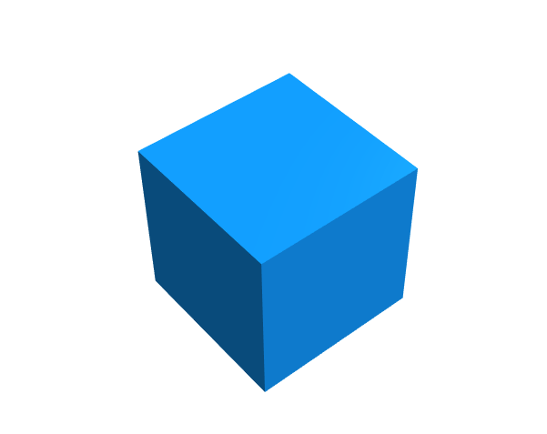
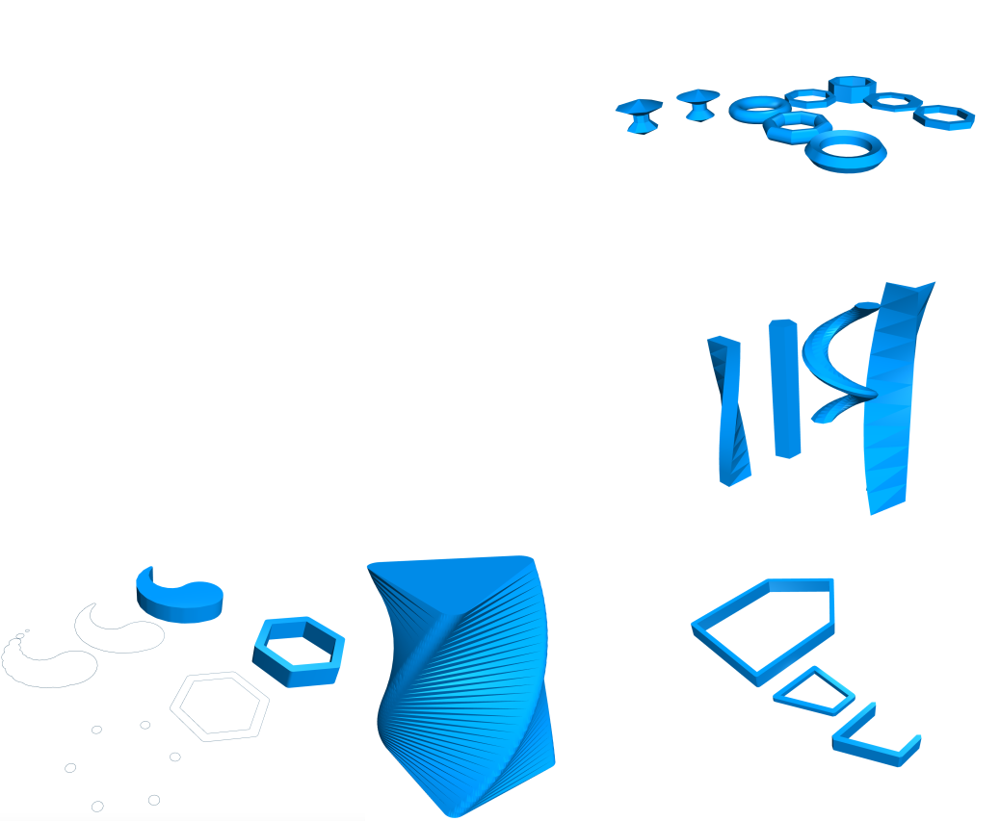
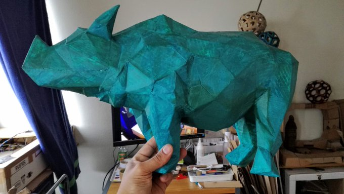

## JSCAD + DAT

### a match made in decentralized heaven ?

By [Mark Moissette]()

https://openjscad.org

---

## What is JSCAD

---

### Draw by coding !

```javascript
    function main(){
        return cube()
    }
```
 <!-- .element: class="fragment" -->

---

### Your toolbox

---

#### 2d & 3d shapes <!-- .slide: data-background="#ff0000" -->

- rectangle <!-- .element: class="fragment" -->
- circle <!-- .element: class="fragment" -->
- polygons <!-- .element: class="fragment" -->
- cube <!-- .element: class="fragment" -->
- sphere <!-- .element: class="fragment" -->
- cylinder <!-- .element: class="fragment" -->
- torus <!-- .element: class="fragment" -->
- etc <!-- .element: class="fragment" -->

---

#### Transformations

- translate (move)
- rotate()
- scale()

---

#### Glue, cut, carve aka: Boolean operations

- union (glue)
- difference (carve)
- intersection (keep parts overlapping two bojects)

---


---

#### Other operations/ functions

- extrusions (2D => 3D)
- hull() / chain hull()
- connectors
- a lot more !

---



---

#### simplicity

- it is "just javaScript"
- functions, functions functions !

---

### Different flavors

- web 
- CLI
- Desktop

---

### What for ?

- fun 
- education
- 3d printing
- lots more

---

#### Examples

---

[Gofree: keyboard glove modeling in Jscad (video tutorials)](https://www.youtube.com/playlist?list=PLCiWVcSJ1UJQPNZWqu3OJzZbrwLdO39S9) <!-- .element: class="fragment" -->
 <!-- .element: class="fragment" -->
## What is JSCAD

---

### Draw by coding !

```javascript
    function main(){
        return cube()
    }
```
 <!-- .element: class="fragment" -->

---

### Your toolbox

---

#### Primitives (2D) <!-- .element: class="fragment" -->

- rectangle <!-- .element: class="fragment" -->
- circle <!-- .element: class="fragment" -->
- polygons <!-- .element: class="fragment" -->
- etc <!-- .element: class="fragment" -->

----

#### Primitives (3D)

- cube
- sphere
- cylinder
- torus
- etc
- Item 1 
- Item 2 

---

#### Transformations

- translate (move)
- rotate()
- scale()

---

#### Glue, cut, carve aka: Boolean operations

- union (glue)
- difference (carve)
- intersection (keep parts overlapping two bojects)

---


---

#### Other operations/ functions

- extrusions (2D => 3D)
- hull() / chain hull()
- connectors
- a lot more !

---


---

#### simplicity

- it is "just javaScript"
- functions, functions functions !

---

### Different flavors
- web 
- CLI
- Desktop

---

### What for ?

- fun 
- education
- 3d printing
- lots more

---

#### Examples

---

[Gofree: keyboard glove modeling in Jscad (video tutorials)](https://www.youtube.com/playlist?list=PLCiWVcSJ1UJQPNZWqu3OJzZbrwLdO39S9) <!-- .element: class="fragment" -->
 <!-- .element: class="fragment" -->


### Aims

  - accessible
  - reusable
  - from everywhere
  - community centric

### Aims

  - accessible
  - reusable
  - from everywhere
  - community centric

---

reminds you of anything ?

## JSCAD + DAT = :heart:

  - dat => simple to use (esp with Beaker)
  - dat => accessible everywhere
  - dat => versioned
  - dat => less technical (more accessible than Git & co)

### Ease of sharing

  - jscad designs: code: files & folders
  - dat good at ...sharing the above

### Future prospects

  - "packages" shared & used via dat: require('dat://user/designLib')
  - a possible specialized [Hashbase](https://hashbase.io/) like instance to simplify seeding
  - but focus is user <-> user , we are just there

